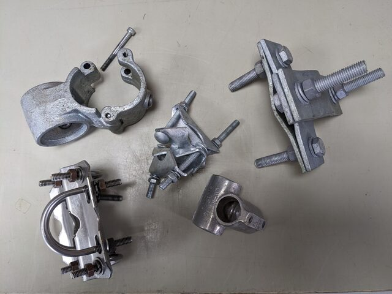

# Climbing and rigging

## Riggers

For tower builds, tower inspections, rigging, contact the rigging companies below. All operate Australia-wide:

-   Commconns constructions, 30 Backwater Crt, Kirwans Bridge, VIC 3608, Phone 0407 576 343, Ian Burrowes [ian\@commcons.com.au](mailto:ian@commcons.com.au){.email}, admin\@commcons.com.au \
    --\> Built Whroo and Wombat Forest tower

-   High Access Rigging, Ian Grivel, 0418 896 688

-   Karera Pty Ltd, 2/49 Gavenlock Road, Tuggerah, NSW, 2259, Phone 1300 425 905, Joel Dawes [joel.dawes\@karera.com](mailto:joel.dawes@karera.com){.email}, sales\@karera.com, [www.karera.com.au](www.karera.com.au) \
    --\> Built Tumbarumba tower

-   Meridian Communications, A 71 Metrolink Circuit, Campbellfield VIC 3061, Bernie Cunningham, [bcunningham\@meridiancommunications.com.au](mailto:bcunningham@meridiancommunications.com.au){.email}, [www.meridiancommunications.com.au](https://www.meridiancommunications.com.au/) \
    --\> Built stand-alone Wombat Forest tower

## Working at heights competency

Two nationally accredited training units are essential to work on an Australian tower as mandated by the Australian Government:

-   [RIIWHS204E Work safely heights](https://training.gov.au/training/details/RIIWHS204E/unitdetails)

-   [ICTTCR203 Use safe rigging practices to climb and perform rescues on telecommunications network structures](https://training.gov.au/training/details/ICTTCR203/unitdetails)

Re-training is recommended every two to three years if not competent, or "if not actively working at heights" frequently.\
The training certificates do not expire officially by law, but employers or tower owners might require regular re-training regardless. Check with your OHS team!

### Tower climbing and rescue training courses

-   [Pinnacle Safety and Training: Tower climbing and rescue training](https://www.pinnaclesafety.com.au/courses/height-safety/tower-rescue-training)

-   [Safety Training Australia: Work Safely at Heights training](https://safetyaustraliatraining.com.au/work-safely-at-heights/)

Ensure the training covers both, RIIWHS204E and ICTTCR203!\
One-day refresher courses are available for people who already did the full two-day training courses.

## Climbing gear

Two persons must be present when climbing a tower. Each person must have a full set of climbing safety gear and work gear. Items must comply with the Australian Safety ratings.

See [Tower Climbing equipment (Heightdynamics)](https://www.heightdynamics.com.au/tower-climbing-tools-for-telco-workers/) for details.

-   Harness

-   Helmet

-   Twin-hooks, ie twin fall arrest lanyard

-   Work positioning lanyard (Pole strap or e.g. Petzl Grillon)

-   Tower rescue kit (pulley system, dogbone, descender, etc, ..., see detailed list and link below)

-   static work rope (longer than height of tower)

-   static rescue rope 11 mm OD (longer than height of tower), Australian Standard 4142.3

-   Ladsafe detachable cable sleeve, fall arrest system compatible with the ladsafe rope system on the tower

-   small first aid kit

-   carabines (at least five per person)

-   rated slings (at least five per person)

-   pulley wheel(s)

-   rope brake

-   climbing tool bags with tool-lanyards

-   tools with lanyard attachments (tool fall protection)

-   wrist strap to secure tool-lanyards while working

-   two-way radio

-   gloves

Yearly climbing gear inspections by a certified inspector are required. Contact rigging companies to schedule inspection.

## Pick-off tower rescue

A short, non-comprehensive, and unofficial, ***not certified*** overview on the pick-off rescue technique that allows you to rescue a stranded colleague from the tower. This list does not replace accredited training sessions. **Follow the instructions at your own risk!**

**This procedure is only to be performed by a qualified and competent operator!**

Training and familiarity with the procedure is required. This is a short overview on the steps s a reminder. The instructions might be incomplete or might not cover your situation.

[Description Rope Access Pick-Off Rescue for Tower Workers (Rigging Lab)](https://rigginglabacademy.com/rope-access-pick-off-rescue-for-tower-workers/)

-   Alert emergency services before climbing up on the tower

-   Look after your own safety first, only climb and help if you're competent and trained in the rescue procedure!

-   Gather rescue kit:\
    harness\
    helmet\
    static rope, 11 mm OD, longer than tower height, with figure8 knot at the top end and knot at the lower end\
    sling, carabiner for securing the rope on the tower\
    twin-hooks\
    work positioning lanyard (pole-strap, Petzl Grillon)\
    pulley system (Petzl Jag)\
    Petzl ID with additional carabiner for rope brake to safely lower two people\
    dog bone, ie two carabiners connected with short sling\
    additional carabiners\
    radio\
    mobile phone\
    small first aid kit

-   always maintain proper fall protection at all times

-   climb to the casualty, provide first aid if possible

-   climb past the casualty, secure the abseil rope to tower several meters above the victim (basket sling, carabiner, figure-8 knot

-   descent back down to casualty, establish safe work position using twin hooks, staff pole

-   use pulley system to lift casualty towards you, pulley connects harness anchor points of both persons

-   connect harness main anchor point of victim to your harness main anchor point using dog bone (two carabiners connected via short sling, or two carabiners connected with dogbone, or y-lanyard)

-   feed rope through descender (Petzl ID), double check correct direction, AND loop rope through carabine on secondary harness (hip) anchor point as brake (because the Petzl ID is only rated for one person!)

-   ensure safe connection between victim and you

-   when victim is safely connected to rescuer, remove any ladsafe, pole-strap, safety device etc between victim and tower.

-   descend the tower on rope using both Grillon and carabine rope brake

-   continue delivering first aid to the victim until emergency services arrive

## Rigging, clamps, mounting hardware

Clamps for installing crossarms, instrumentation, and to build tower elements

Check material compatibility regarding oxidation when connecting steel with aluminium clamps.

Providers for clamps and other mounting hardware:

-   [RFI Technology Solutions](https://www.rfi.com.au/comms-products/installation-components/clamps) provide various clamps, antenna mounts, "bull bar brackets". Their clamps are very solid items, a riggers favourite regarding strength and durability.

-   [Tubeclamp](https://www.tubeclamp.com.au/) provide smooth round clamps, good for installs where turbulent air flow is a problem, e.g. in vicinity of the anemometer. They provide split clamps for easy install of crossarms too.

    -   Downside: Only one bolt is securing the connection on each side, hence these are not as rigid as other clamps. Use threadlocker.

-   [Interclamp fittings](https://www.interclamp.com/products/interclamp-fittings/) Wide variety of tube fittings, similar to Tubeclamp and Unifit.

-   [UniFit](https://www.uni-fit.com.au/) Handrail fittings that can be used for instrument mounts or non-load-bearing applications. Similar to Tubeclamp and Interclamp

-   [NuRail](https://www.nurail.com/) The default clamp system for Licor instruments and some Campbell Scientic instruments. Smooth, round clamps to limit air disturbance around instruments.

    -   Bolts can seize up after several years.
    -   No local Australian distributor, except Campbell Scientific for selected items.
    -   imperial tube sizes only, potential issues when working with Australian pipe sizes.

-   [Campbell Scientific: Specialised mounts and general clamps, including NuRail](https://www.campbellsci.com.au/) (offer specific instrument mounts, but also general mounting systems, clamps)

## Pipes, tubes

Buy metal, steel, aluminum poles at your local steel and aluminium merchant.

Aluminum and steel tubing usually have in-compatible diameters!

Connections between steel and aluminium can become oxidised!

[Home](./Home.html)