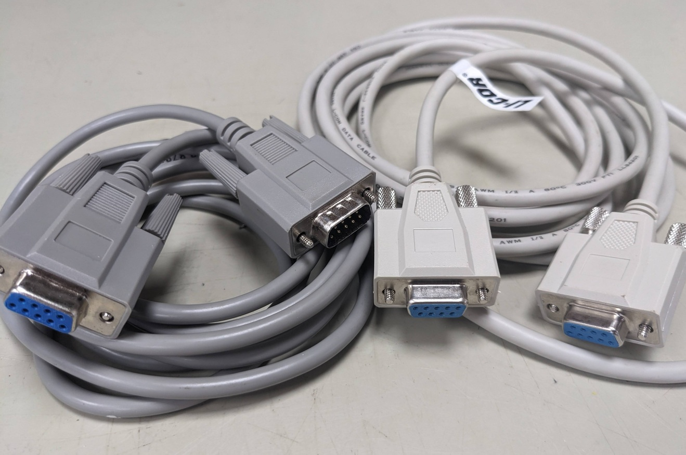

# Communication

## Direct download from data logger

In the simplest case, communication with a logger can be done directly, by connecting a computer to the logger and downloading the data manually. This method is straightforward but requires physical access to the logger.

### Serial communication

Many modern computers don't have a serial port any more, so a USB-to-serial adapter is required. Recommended serial-to-usb adapter (known to also allow complex serial operations like firmware upgrades of a Li6400):

[FTDI Chip model US232R-10 usb to RS232](https://ftdichip.com/products/us232r-10-bulk/)

Available via e.g.

-   [RS-online](https://au.rs-online.com/web/p/interface-adapters-converters/0429274)

-   [Li-COR USB-to-serial connector](https://shop.licor.com/env/store/product?c=photoextra&n=6400-27)

After connecting the converter to your computer, check your computer settings what serial port the adapter is using (e.g. COM7). Windows: check "`Device manager`", section "ports" Windows port-assignments can change depending on where the converter is plugged in. For Linux: check `ls /dev/tty*` for new devices e.g. `ttyUSB0` or `ttyACM0`.

The newer generation Campbell Scientific (CR310, CR6, CR1000x) and other manufacturer's loggers have built in USB-to-serial converters. No dedicated serial cable and plug are required for those, a USB cable is sufficient to connect. The communication protocol is still RS232 and it is still required to know what serial port is used for communication.

Li-Cor uses a null-modem / cross-over cable to communicate with their devices, while Campbell Scientific uses a straight-through serial cable. They are not compatible!

-   Campbell-Scientific-compatible *straight-through* *serial cable* for Campbell Scientific loggers and instruments, CR1000, CR3000, CR310, CR10x, ... e.g.: [Male D-Sub 9-Pin to Female Serial Cable](https://au.rs-online.com/web/p/serial-cables/1828782)

-   Li-Cor compatible *null-modem / cross-over cable* (for e.g. Li7500, Li6400, Li810) [Female D-Sub 9-Pin to Female D-Sub Modem Cable](https://au.rs-online.com/web/p/serial-cables/2863537)

**The two cable types are** **incompatible** out of the box. The main difference between the two is the cable-internal wiring, not necessarily the plug configuration! (Plug-converters exist). A null-modem cable has pins 2 and 3 swapped between the two ends - check electrical continuity of the pins to determine cable type!

## Modem

If a site has reasonable 4G/5G coverage, a modem can used for data transmission [(Telstra coverage map)](https://www.telstra.com.au/coverage-networks/our-coverage). In Australia, the recommended - and frequently only - phone network for remote locations is Telstra. TERN EP provides data-only Telstra SIM cards on request. Some towers might not require a 4G modem if there is an alternative internet connection (WiFi, DSL, fibreoptics, fixed-wireless, satellite, ...) readily available. Then a router will suffice.

### 4G modem options

Selection criteria for modems:

-   Operating ranges (voltage, temperature): The modem must be able to operate using the available voltage(s) to avoid conversions. The modem must be able to operate within the anticipated temperature range of a research location. E.g. -20°C to 50°C.

-   Form factor: Chose a modem that fits in the available enclosure space, especially if all loggers and network devices must fit an a single enclosure. Modems that can be mounted vertically on a DIN rail allow to save space and use the "height" of the enclosure. Many modems offer DIN rail mounts, but some have the rail mount in a location so that it can not be installed in space-saving way. Then adapters might be required.

Recommendations for industrial-grade modems:

-   [Maxon Quadmax MA-6060](https://rfi-sb.rfi.com.au/MA-6060) Slim-line modem, dual SIM slots, four ethernet ports, dual 4G antennas, two WiFi antennas, DIN rail on the thin side. Has built-in analog relay to devices like e.g. phenocam. Capable to connect to OpenVPN, and similar services.

-   [Maxon Dualmax MA-2055](https://rfi-sb.rfi.com.au/MA-2055) Flat, but slightly wide modem, dual SIM slots, two ethernet ports, dual 4G antennas, no WiFi (!), DIN rail on the wide side (not space-saving out of the box). Capable to connect to OpenVPN, and similar services.

-   [Robustel R1520](https://www.rfi.com.au/R1520) Wide modem, dual SIM slots, two ethernet ports, dual 4G antennas, WiFi, DIN rail on the wide side (not space-saving out of the box). Capable to connect to OpenVPN, and similar services.

-   [Belden Netmodule 1601](https://www.belden.com/products/industrial-networking-cybersecurity/wireless/iiot-and-industrial-routers/nb1601-lsc) Slim-line modem, dual SIM slots, four ethernet ports, dual 4G antennas, two WiFI antennas, DIN rail on the thin side. Has built-in analog relay to devices like e.g. phenocam. Capable to connect to OpenVPN, and similar services.

-   [Campbell Scientific Cell220](https://www.campbellsci.com.au/cell220) Serial modem well integrated the the Campbell Scientifc logger ecosystem. The Modem is conveniently configured via the logger program (CRBasic). This modem can interact directly with logger, and data and provides diagnostic output (like signal strength, uptime) to data tables on the logger. Modem actions can be triggered depending on logger or measurement status. No WiFi, no ethernet ports, dual antenna, single SIM card. Small form factor, highly configurable. Similar serial modems are available elsewhere too, as long as they support he full range of AT modem commands (ie Netmodule NB1600).

Note: As TERN EP provides **data-only SIM cards**, the monitoring and feedback-options that rely on SMS text messages of the above modems will not work! There is no "phone" quota associated to these SIM cards. E.g. the Quadmax modem can not send a warning SMS when switching from primary to the secondary SIM card when the primary card fails! And any IP-address monitoring and dial-in options these modems provide (e.g. direct dial-in in case OpenVPN fails), don't work with data-only cards either.

### Antennas

-   Omnidirectional (omni) antennas are "install and forget": they will connect to any phone network in the area, and can switch between multiple network towers depending on signal strength or if a phone tower goes offline.

-   Directional (yagi) antennas must be pointing to a known, specific network tower. This will improve the signal. The downside is, that the antenna points to a specific tower. If that network tower goes down, this antenna will not connect to another tower.

In locations with marginal reception, it is recommended to use a modem that allows the use of two antennas, preferably yagi, in parallel (MiMo). Both antennas must be pointing to the same tower (!), and must be about 50 cm apart vertically for optimal signal boost.

-   [Directional antenna, Mimo capable](https://blackhawkantennas.com.au/product/blackhawk-lpda-antenna/)

Check for available towers in the area on these websites:

-   [RFNSA Radio Frequency National Site Archive](https://www.rfnsa.com.au/)

-   [ACMA map](https://web.acma.gov.au/rrl/site_proximity.main_page)

-   [Ausphonetowers](https://ausphonetowers.com.au/)

To determine line of sight between a phone tower and your location:

-   <https://incoherency.co.uk/line-of-sight-map/>
-   <https://www.scadacore.com/tools/rf-path/rf-line-of-sight/>

Neither of these antenna-map websites can guarantee that there will be reception at the location. A fieldtrip with modem and antenna(s) and a long pole is usually required to check connectivity.

## Satellite communication

to do

-   12V Starlink Mini

-   240V Starlink either via inverter or via 12V modification, POE injector? see below [Communication.html#poe-injectors](./Communication.html#poe-injectors)?

-   how to do TERN OpenVPN via limited, locked-down Starlink router? Daisy-chain quadmax-modem/router or similar behind Starlink router?

-   Power consumption during transmission?

-   Constant connectivity or interrupted depending on satellite availability, rain, leaves? Problem with disconnects?

## Router

Check if a modem provides sufficient ethernet ports (router functionality) for all the devices on the local tower network. Consider a modem with sufficient built-in ethernet ports. Avoid "office-grade" network routers. Check if what data transmission rates are required at a research tower. Chose a GBit capable-router if required (ie for high-frequency spectral data or similar high-volume data acquisition). Many industrial MBit-class routers offer sufficient performance for flux-related data transfer and are more robust.

### Router recommendations

Unmanaged-routers:

-   [Industrial 5-port 100 MBit router](https://www.brainboxes.com/product/industrial-ethernet-switches/fast-ethernet/sw-505) (5 to 30V, DIN rail mount)

-   [Industrial 8-port 100 MBit router](https://www.brainboxes.com/product/industrial-ethernet-switches/fast-ethernet/sw-508) (5 to 30V, DIN rail mount)

-   to do: recommendation for GBit networks?

General network routers like office-grade, indoor routers (e.g. Netgear) are known to be more susceptible to electrical interference (lightning, power surges) and do not operate well at extreme temperatures compared to "industrial" routers.

## POE injectors

Some network devices like WiFi extenders (Starlink?), require power-over-ethernet. This provides the power to operate the device via the ethernet cable.

As ethernet cables have a tiny diamater, voltage is boosted by the POE injector to cover large distances.

Large devices like UniFi Outdoor 7 WiFi hub requires POE+ ie 56V to operate!

Be aware of power demands: The conversion from 12V to 48V or even 56V to operate a POE device is power-consuming. These POE injectors can use 0.6A (7.2 W\@12V) continuously, which is about 2/3 of an all-in-one flux tower (0.8A)!

Recommended 12V-operated POE injectors (<https://www.telcoantennas.com.au/>):

-   [POE 12V to 48V](https://www.telcoantennas.com.au/12vdc-to-48vdc-poe-passive-power-over-ethernet-inj)

-   [POE+ 12V to 56V](https://www.telcoantennas.com.au/12vdc-to-56vdc-poe-power-over-ethernet-injector)

[Home](./Home.html)