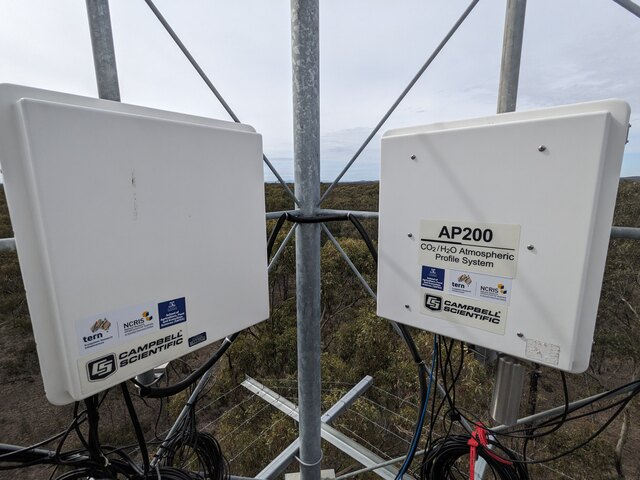
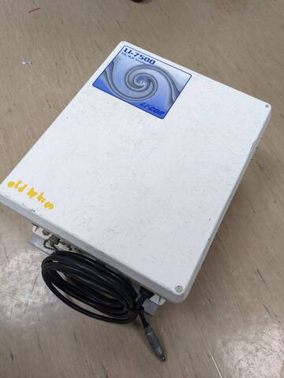
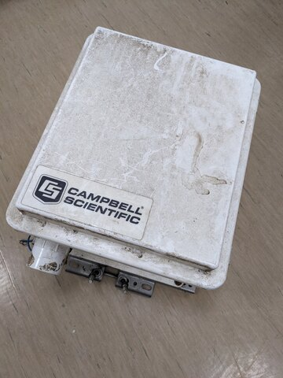
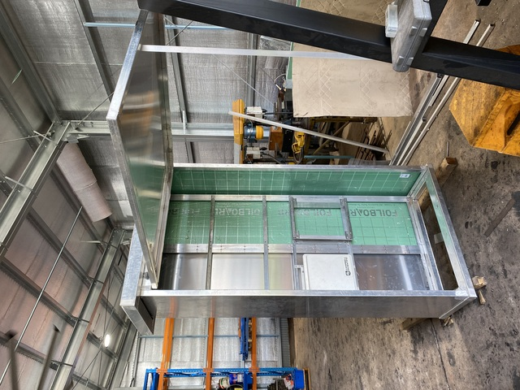
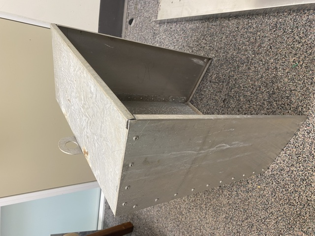
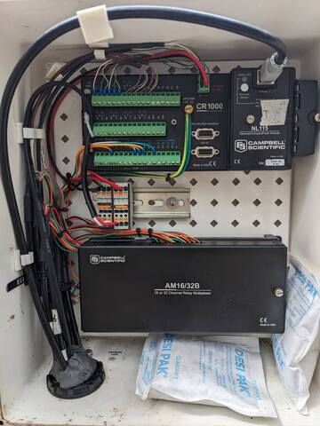
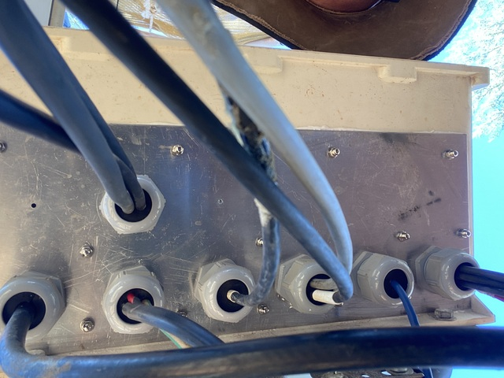
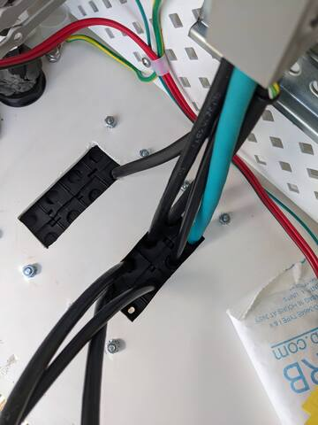
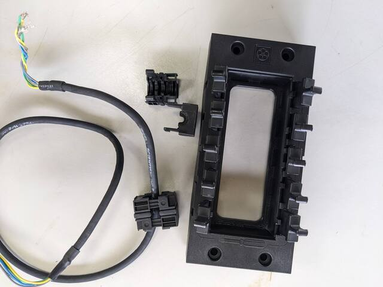

# Enclosures

## Commercial enclosures

### Fibreglass

Fibreglass enclosures are the default for instruments from Licor and Campbell Scientific. These are relatively lightweight and come with attachments to suit towers and poles. In the case of enclosures from Campbell Scientific, their included peg-board mount fits they data logger and accessories.\
Long-term, fibreglass enclosures degrade to varying extent due to sun/UV exposure. They can delaminate. and become brittle. Delamination can happen within one year, but might not happen after several years. Custom shade covers are recommended in some areas (see below).

-   [Options for Campbell Scientific enclosures (fibreglass and steel)](https://www.campbellsci.com.au/enclosures)

### Metal

Metal enclosures are standard in many electrical installations. They are not always best for flux towers, though. Metal enclosures with plastic locks or other parts fail similarly to fibreglass enclosures as the UV degrades the plastic parts.\
Working with steel enclosures can be difficult to drill into to install cabling, and they can rust. The weight of steel enclosures can make install on tower more difficult.\
Aluminium enclosures can be too flimsy for long-term use in the field, depending on type. A big downside of aluminium is heat buildup inside. A sun cover is recommended depending on location.

-   In general, check the quality of hinges, locks, and ensure that wast can not pool on top of the seals of the enclosure. Ensure good grounding / earth protection for metal enclosures

-   If vandalism or theft is a possibility at the tower location, consider heavy duty enclosure are add additional protection around the instrumentation (see below)

-   Suppliers of enclosures\
    [IP Enclosures](https://www.ipenclosures.com.au/aluminium-electrical-enclosures/)\
    [Delvallebox](https://www.delvallebox.com/en/aluminium-electrical-enclosures/aluminium-wall-enclosure-ip66-luxor) see their NEMA steel series\
    [Tropac enclosures (untested)](https://www.tropac.com.au/enclosures)\
    [Campbell Scientific enclosures (fibreglass and steel)](https://www.campbellsci.com.au/enclosures)

## DIY enclosures and shade covers

Better protection in harsh environments from wildlife, and weather. Matt Northwood built custom structures that protect the enclosures from ants, provides sun protection for the enclosures inside and for people working in the instruments, improved protection from wildfire and weather, increased security.

-   Shade cover\
    Custom cover to fit over enclosure:\

\
Custom shade cover for a Campbell Scientific fibreglass enclosure (Matt Northwood)

# Cable glands, cable entry into enclosures

## Glands and putty

The simplest way to feed cables into an enclosure is a simple hole with protective pipe. Once the cables are installed, the hole is sealed with electrical putty against water ingress and wildlife.\

-   This is not a perfect seal as insects and water will still get in! And the electrical putty becomes brittle over time. Still, it is a simple and fast way to install cables. Campbell Scientific enclosures use this system by default. Such electrical putty is hard to find in Australia (?). Campbell Scientific provides electrical putty with their enclosures.
-   [LAPP Australia Cable glands](https://lappaustralia.com.au/en/nylon-cable-glands)
-   [Prysmian R391 Electrical Weatherproof Compound, Supplier 1](https://www.swiftsupplies.com.au/r391-weatherproof-electrical-putty-500gm-kit)
-   [Prysmian R391 Electrical Weatherproof Compound, Supplier 2](https://www.connectionsolutions.com.au/product/prysmian-bicon-r391-electrical-weatherproof-compound/)

### Glands with multi-hole inserts

Multi-hole inserts provide a better seal around the cables than the electrical putty shown above.

-   Installing and removing cables is not as easy compared to the other methods, especially if there are plugs at the end.

-   these inserts provide excellent cable management

-   [Lapp Australia Multi-Hole inserts](https://lappaustralia.com.au/en/multi-hole-inserts)

### Skintop cubes

An alternative to cable glands are skintop cubes. A rectangular frame is installed into the enclosure wall. This frame holds eight to ten inserts that surround individual cables entering the enclosure.

-   as each cable has it's own insert, individual cables can be easily removed / inserted. This becomes handy when wires need replacing or when installing cables with plug at the end, like e.g. ethernet

-   relative expensive

-   the inserts are initially difficult the remove from the cables. This can be frustrating on location. After re-opening them once or twice, though, they can be opened without tools while still being watertight afterwards.

-   [available from Lapp Australia Skintop Cubes](https://lappaustralia.com.au/en/skintop-cube-frames)

F
[Home](./Home.html)