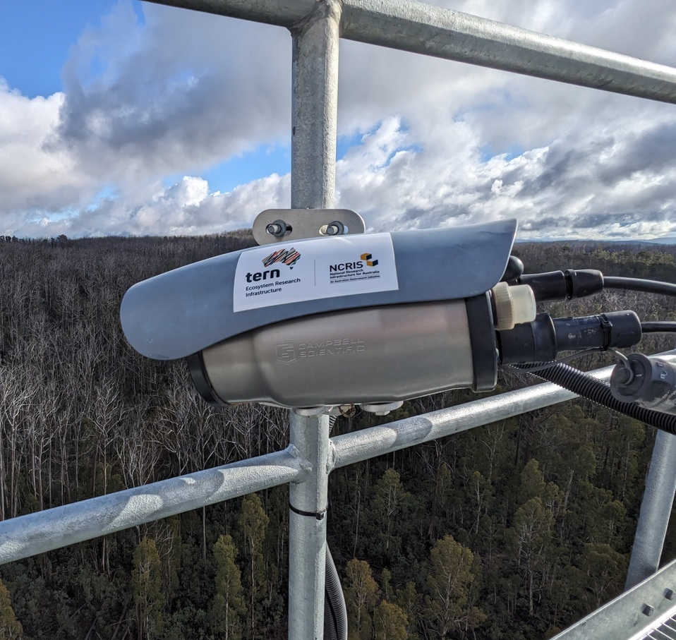
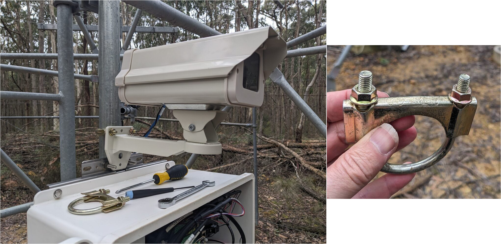

# Phenocams

## Phenocam models

### Campbell Scientific CCFC

Across the TERN OzFlux network, many sites are equipped with the Campbell Scientific [CCFC camera](https://www.campbellsci.com/ccfc).

This camera integrates well with the TERN network as it supports ssh-based sftp file upload via ssh-keys to the TERN data portal automatically. It is extremely well built, is its own wheaterproof housing, but rather expensive. It is the **preferred model** for TERN-supported flux towers.

In addition to the usual visible light photo, the camera provides NDVI images directly. Or it can be set up to take visible light, NDVI, and an IR image. Default for TERN for this camera is to provide the visible light photo and the NDVI image.

The CCFC uses a weatherproof ethernet cable (10 m) for communication and a separate power cable for 9 to 30 V. Settings and live images can be accessed via the built-in WiFi connection.

An external relay can be used (e.g. using the relay available in the Maxon Quadmax modem) to wake the camera from deep sleep via a 12V trigger signal.

The camera is fully integrated into the Campbell Scientific sensor network and can interact with dataloggers and Loggernet via Pakbus.

To mount the camera the bracket [18549 ACC CC Camera or PWD22 Mounting Kit](https://www.campbellsci.com/order/p18549) is required. Alternatively, Nico provides a custom, versatile mount for the CCFC (or provides the CAD drawings to manufacture it yourself).

Ensure the camera has the latest firmware installed! E.g. Older firmware versions do not add a colour scale to the NDVI images - this makes it difficult to interpret NDVI images across the network.

#### Data upload to TERN from a Campbell Scientific CCFC camera

A generic configuration file to enable taking scheduled photos, file names, and upload setting is available for download [here (CCFC XML configuration file)](./downloads/CCFC-9999-20260723_generic.xml). After loading this configuration file onto the camera via `Settings/Advanced/Upload configuration` in the web interface, adjust the site name (`AU-Xxx`), WiFi access point password, etc to suit your camera.

The camera provides an ssh key in its web interface. Send this key to TERN (Gerhard) via keybase file transfer. Username for the upload is usually the camera name - check with Gerhard or TERN support.

### Stardot Netcam Live 2

A cheaper alternative to the Campbell Scientific CCFC is the Stardot [Netcam Live 2 camera](http://stardot.com/netcamlive) (StarDot Technologies, Buena Park, CA, USA). For camera details and a performance review of the Netcam live 2 camera compared to the previous model see @javadian_continuity_2025. The camera does not have a deep sleep mode, it is always on. It uses about 400 mAh\@12V of power.

The Stardot [Knowledge base for the Netcam Live2 camera is available here](https://stardot-kb.netlify.app/kb/files/).

**This camera does not capture NDVI images directly, but provides separate visible light (RGB) and IR images to calculate NDVI off-camera!**

The weatherproof housing and mounting arm must be ordered additionally: [Compact Outdoor Enclosure with Wall Mount Enc-Outd3](http://stardot.com/products/compact-outdoor-enclosure). This wall-mount arm needs to be modified slightly to install it on a round pole (50 mm OD pipe) on a tower. The holes in the wall mount can be opened up further. Then use e.g. a [C9 2⅛" exhaust clamp](https://autobarn.com.au/ab/Autobarn-Category/Shop-our-Full-Range-by-Brand-at-Autobarn/Walker/Walker-Exhaust-Clamp-54mm-2-1-8in---C09P-1-/p/SP00895) to adapt the flat mount to a pole mount, and use a second C9 clamp with a brace for additional rigidity. A U-bolt as provided by Campbell Scientific can be used as well.

Power is provided either via a 12V barrel jack, or via POE.

For detailed setup instructions for this camera, albeit for the international phenocam network, not the TERN data portal, see [Phenocam network Netcam Live 2 install instructions](https://phenocam.nau.edu/pdf/PhenoCam_Install_Instructions.pdf).

#### Software to upload images from the netcam live2 camera to TERN:

See [the netcamTERN upload software repository](https://github.com/MarkusLoew/netcamTERNupload) regarding uploading photos to TERN automatically.

### AXIS cameras

Other camera options are

-   [Axis P1487-LE Bullet camera](https://www.axis.com/products/axis-p1487-le.) (Older model as used within the OzFlux network was [Axis P1467-LE camera](https://www.axis.com/products/axis-p1467-le/support) )

-   [Axis P1488-LE Bullet Camera](https://www.axis.com/products/axis-p1488-le) (Older model as used within the OzFlux network was: [Axis P1468-LE Bullet Camera](https://www.axis.com/products/axis-p1468-le/support))

### General settings for TERN and manual upload

See the upload paths on UQ RDM and the TERN naming conventions at <https://ternaus.atlassian.net/wiki/spaces/TERNSup/pages/2629730756/Phenocam>

The camera models above all allow to changing the filename of the photos to match the pattern expected by TERN.

Images get uploaded to UQ RDM file storage via sftp, or if the camera is within the TERN OpenVPN network, via ftp. The images get ingested into the TERN data portal within 24 hours and are then deleted from UQ RDM.