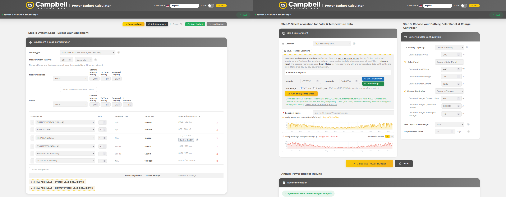
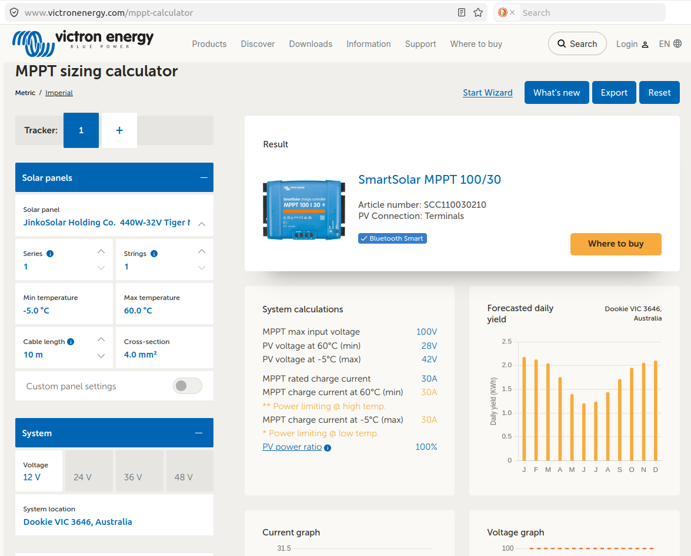
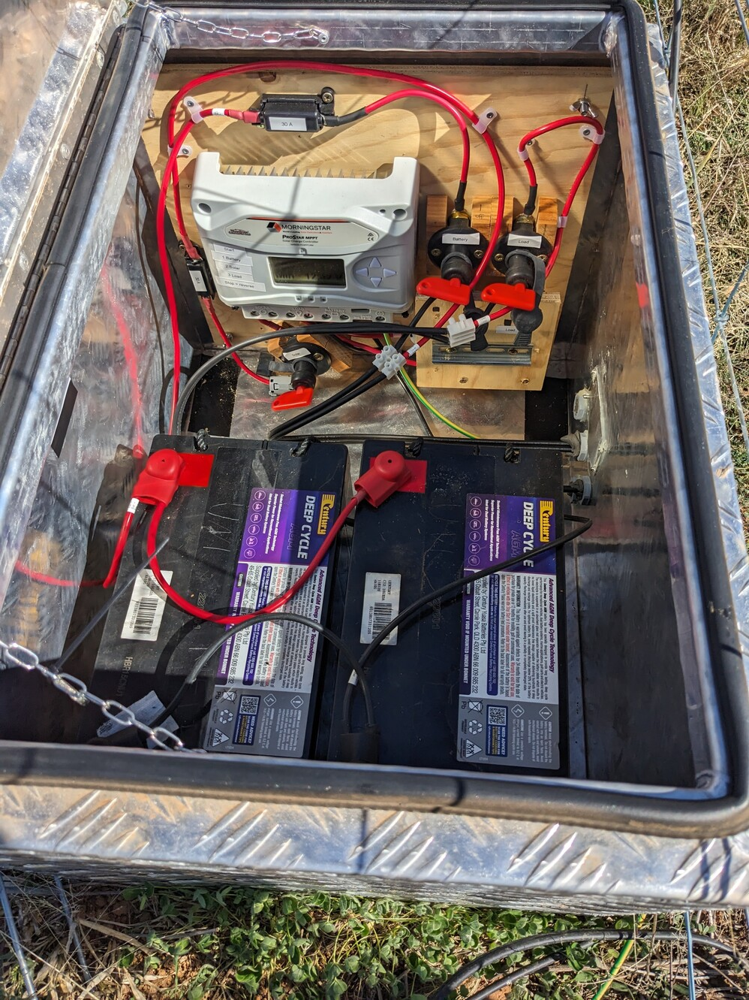
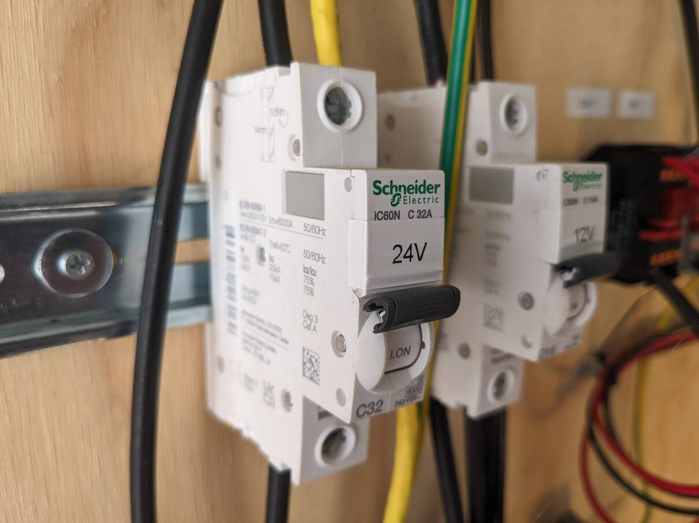

# Power

## Powering the flux tower

### Power demand

-   [Campbell Scientific power budget spreadsheet](https://www.campbellsci.com.au/downloads/power-budget-spreadsheet) and online tool. This spreadsheet and online tool provides power consumption data for Campbell Scientific devices and allows to calculate an overall power budget.

-   [Victron MPPT calculator](https://www.victronenergy.com/mppt-calculator): Suggests charge controller model, calculates daily yield from solar panel size and configuration, voltage, and location. This calculator includes an allowance for oversizing solar panels on a charge controller.

The all-in-one flux tower described at [Sensorwiring](./Sensorwiring.md) with the described sensors and Maxon Dualmax modem has a constant power draw of about `0.6 to 0.9 A at 12V (< ~10W)`.

For comparison: Flux-towers in the ICOS network (Class 1, 2) are required to have at least 2.5-3 kW of continuous(!) power available year-round @rebmann_icos_2018 .

### Power sources

#### Mains power

If an electrical power grid is available nearby to tap into, mains power is a convenient power source.\
E.g. the *Ecosense Forest* in Germany with flux tower many research systems is powered from the nearest electrical interchange 700 m away (@tesch_ecosense_2025).\
The *Kranzberger Forst* research site with scaffolding towers and canopy crane site is connected to continuous municipal electrical power @haberle_kroco_2003 from the nearby township.

The install of a 240V electrical system at a tower location requires a certified electrician. Any 240V power connection beyond plugging an instrument into a e.g. solar-powered inverter powerboard requires electrical inspection and approval!

#### Generator

A generator is a powerful source of energy. It requires regular maintenance (e.g. every 100 hours of runtime) and re-fueling, though. Daily running costs are relatively high compared to solar power. Operational costs of the generator powering the Tumbarumba tower is about \$9 per day (fuel - pre-2026 price - and regular maintenance included). That generator requires maintenance four times a year and re-fueling twice per year. It runs for about six to eight hours every 8 days to charge the batteries that power the research site. A local car mechanic services the generator when the maintenance interval is up. The run-time of the generator is monitored online to advice the mechanic.

\
If a generator is used, "*the effect of its exhaust gases on the trace gas measurements must be minimised*" and wind-direction-based screening might be required to avoid generator exhaust gases in the footprint (@aubinet_eddy_2012). The generator should be deployed away from the flux instruments to avoid bias @moore_beginners_2024 , @rebmann_icos_2018 .

#### Solar panels

Solar panels on tower can affect the wind flow, turbulence, and radiation patterns around the flux tower. **Consider wind loading** on tower! The tower must be rated to carry solar panels of the specific physical size!

-   DIY battery system / professionally installed power system ?
-   no specific suggestion on solar panels, models, brands?

### Solar power systems

to do - Solar panel size (to do) E.g. JinkoSolar 440W - in many electrical wholesale shops it is difficult to find smaller solar panels! - Solar panel mount (to do) - Earth rod (to do)

### Charge controllers

-   [Morningstar ProStar MPPT solar charge controller](https://www.morningstarcorp.com/products/prostar-mppt/). The maximum solar panel size: 300W\@12V.
-   [Victron SmartSolar Charge controllers](https://www.victronenergy.com/solar-charge-controllers) Usually, for a 400 W panel, use the 100/30A or 100/50A charge controller. Check the Victron MPPT sizing calculator to determine the [charge controller size](https://www.victronenergy.com/mppt-calculator), see below:

## Battery

To continuously operate a flux tower that uses about 0.8 A constantly, a battery of about 100 Ah capacity is recommended. This large battery allows to operate the flox tower for about four days without solar input.

To calculate the battery size:

`Constant current (A) x 24 hours/day x days of autonomy = battery size in Ah`

i.e. `0.8 A x 24h/day x 4 days = 76.8 Ah`. So, *mathematically*, a battery of 76.8 Ah size is sufficient.

**However**, do not discharge the battery too deep!

Stay at least above a state of charge (SOC) of 50% for lead acid batteries, and stay above 80% for a LiFePo4 battery! This avoids damaging the battery and allows to pro-long battery life.

Calculate the actual battery size via `required amphours / lowest SOC = battery size in Ah`

i.e. for

-   LiFePo4 battery: `76.8 Ah / 0.8 = 96 Ah`. The next available 12V battery size is usually **100 Ah**.

-   Lead acid battery: `76.8 Ah / 0.5 = 153 Ah`. This will require a **200 Ah** lead acid battery (or **two** 100 Ah lead acid batteries in parallel!

Check for batteries that are being offered for camping, outdoor live, and boating available from auto or marine shops, camping shops or specialised battery manufacturers.

A non-exhaustive list of selected batteries that power some Australian flux towers in the UoM hub:

### LiFePo4 battery:

-   [Steel-encapsulated LifePo4 battery 100 Ah (BigWei)](https://www.bigweibattery.com.au/product/100ah-bwb-12v-lifepo4-deep-cycle/)

-   or for even more power, room for additional sensors and devices, and/or longer autonomy:

    [Steel-encapsulated LifePo4 battery 200 Ah (BigWei)](https://www.bigweibattery.com.au/product/200ah-bwb-12v-lifepo4-deep-cycle-marine-boat-series-3/) This battery powers the Whroo flux tower (initially one 200 Ah battery was used. When we added the profile system, we connected a second 200 Ah battery). However, a single one of these batteries power a "small", all-in-one flux tower comfortably.

### AGM lead acid battery:

-   [Two of these batteries in parallel (Century 105 Ah)](https://www.centurybatteries.com.au/products/c12-105xda) Two 100 Ah batteries were used for the Whroo flux tower before the re-build.

), load fuse, battery switch, battery fuse, earth rod for tower and power system. All installed inside a passively ventilated aluminium tool box (Total Tools). Box located underneath the solar panel for shading. (Markus Loew).](images/power/Solar_power_system.jpg)

## Battery box

Too many options to list, but here are two options in use at UoM towers

-   [Aluminium tool/ute box from Total Tools](https://www.totaltools.com.au/100586-hrd-2-0mm-900mm-low-profile-aluminium-tool-box-a950lphrds2) that houses multiple 100/200 Ah batteries for Dookie, and Whroo, and other towers, easy to work with but requires custom interior mounting panel)

-   Very compact battery box that still fits two Century 105Ah AGM batteries plus essential solar charge equipment: [Tool chest / generator tool box from Victorian Toolboxes, Melbourne](https://www.victoriantoolboxes.com.au/product/heavy-duty-aluminium-generator-tool-box-caravan-ute-trailer-truck-tool-box/). This model was in use on the Whroo flux tower before the tower-refurbishment.

## Power to the instruments, electrical wiring

-   Victron wiring guidebook for solar power battery systems: "Wiring unlimited" [Victron Energy Wiring unlimited (pdf)](https://www.victronenergy.com/upload/documents/Wiring-Unlimited-EN.pdf), @leeftink_wiring_2019

-   For general wiring and soldering practices, refer to [NASA Workmanship standard for crimping, interconnecting cables, harnesses and wiring](https://standards.nasa.gov/standard/NASA/NASA-STD-87394), @nasa_workmanship_2015

-   12V, 24V, split systems (24V for instruments far away on top of the tower, 12V for small towers) to do

-   cable connections (crimps, soldering, on-location options) to do

-   earth bars (e.g. Jaycar copper bar with 3d printed feet) to do

-   sensor hubs (to do)

-   glue-on cable routing (to do)

## Fuses

### Circuit breakers

Always check if the circuit breaker is rated for your desired voltage, e.g. 12V or 24V.

12-60V rated circuit breakers, DIN-rail mountable e.g

-   [Schneider Acti 9 iC60L, 10 A](https://www.se.com/au/en/product/A9F94110/miniature-circuit-breaker-mcb-acti9-ic60l-1p-10a-c-curve-15000a-iec-en-608981-25ka-iec-en-609472/) For DC (and AC) circuits.

-   Solar panel circuit breaker: [Noark Miniature Circuit Breakers Ex9BP](https://www.noark.eu/en/products/Photovoltaics/DC_Miniature_Circuit_Breakers_Ex9BP_%28New%29), 2-pole version for solar panels is available

-   [General Minature circuit breakers](https://www.se.com/au/en/product-range/7556-acti9-ic60/12144422927-miniature-circuit-breakers/) (check voltage ratings!)

### Fuses

-   [Miniblade fuses](https://au.rs-online.com/web/p/car-fuses/0563536) to fit the Phoenix fused DIN-rail terminals (**recommended option** for sensors and instrumentation) [Fused DIN-rail terminal block](https://au.rs-online.com/web/p/din-rail-terminal-blocks/7081627)

-   In-line blade fuse for e.g. battery terminals from e.g. automotive applications: <https://www.jaycar.com.au/30a-32vdc-water-resistant-inline-standard-blade-fuse-holder/p/SZ2042>

-   In-line glass fuse holder e.g. <https://au.rs-online.com/web/p/fuse-holders/2375259>

-   ANL bolt-down fuses usually for high amperages for e.g. solar battery systems <https://www.solar4rvs.com.au/collections/circuit-breakers-fuses-holders-anl-cnn>

-   MIDI bolt-down fuses (smaller than ANL fuses, do not support the very high end of amperage compared to ANL, but similar functionality in general) <https://au.rs-online.com/web/c/?searchTerm=midi+fuses>

    Check amperage, bolt size, overall dimension to suit your application!

[Home](./Home.html)