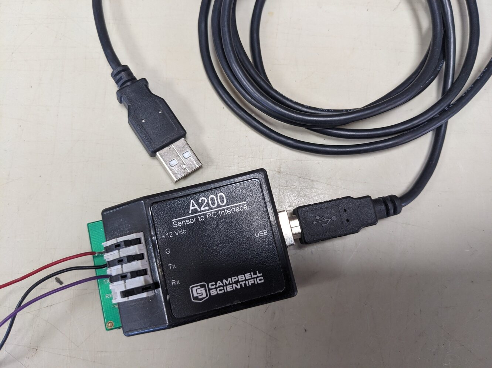

# SDI-12 sensors

SDI-12 is a digitial communiation protocol for environmental sensors overseen by [SDI12-12 group](https://sdi-12.org/) This makes sensor measurements and their wiring easier compared to analog sensors, but also more difficult due to their digital nature.

Each SDI-12 sensor has an internal address/ID that is used to identify the sensor. This allows to connect multiple sensors (of the same or different sensor type) to a single port on a logger. But each sensor on a single logger port must have a unique address! The address is used by the logger to query the sensor to send its data.

## Set SDI-12 sensor address

SDI12 sensors come with a default address from the factory. See the manual of the specific sensor. e.g. Campbell Scientic takes the last digit of the sensors's serial number as address. Other manufacturers assign the same address e.g. '0' to all sensors.

There are at least two options to see and change the address of the sensor:

### Configure SDI-12 sensor via Campbell Scientific A200 Sensor to PC interface

The [Campbell Scientific A200](https://www.campbellsci.com.au/a200) is a USB-powered device that connects a SDI-12 sensor to a PC. The device converts 5V power of the USB port to 12V for the sensor. On the PC, `Campbell Scientific DevConfig` is used to interact with the connected sensor. Select the sensor type from the Devices menu in DevConfig. Then use the provided settings to check and change the SDI-12 address.

### Configure SDI-12 sensor via a data logger

If the A200 device is not available, the Campbell Scientific logger itself can be used to check and change SDI-12 sensor settings. Wire the sensor to one of the odd Control ports of the logger (C1, C3, C5) and power the sensor via the 12V port of the logger. To change sensor settings, only one sensor can be connected to the port. Then connect to the logger either via `DevConfig` or `Loggernet Connect`. Choose the Terminal option to access a direct interface to the logger. Hit the `Enter` key a few times to activate the terminal mode of the logger. Then type 'SDI-12'. A menu pops up offering a list of SDI-12-capable ports to connect to. Select the number of the port with the sensor connected. From here it is possible to query sensor settings via AT commands. See the command table in the logger manual for details on availbale commands and their syntax. Please note that the terminal connection times out after a while. In this case, the connection must be restarted via hitting the *Enter* key a few times.

To do: screenshots

## SDI-12 Hub

While it is fantastic that SDI-12 allow to connect multiple sensors to a single port, the physical wiring can become cumbersome. Each sensor needs 12V power, a control wire, ground connection, etc. Space is limited on the logger. Use a SDI-12 hub instead, either DIY or commercial.

Caution: It is possible that a single failing SDI-12 sensor affects all sensors affected to single port (shorted power, failing sensor). If possible spread SDI-12 sensors across multiple ports - if they are availabe.

The easiest way to multiply the space on a logger is a terminal block with dedicated sections for 12V, Ground and signal. Then wire these sections on the terminal block to the corresponding port on the logger. --\> See section on terminals in the sensorwiring page (to do).

-   Commercial SDI-12 hub: <https://www.campbellsci.com.au/hub-sdm5>

-   DIY terminal hub: see example below

![A DIY SDI-12 sensor hub inside a logger box to allow easy wiring for multiple sensors using push-in DIN rail terminals. Left, fused terminal block for general 12V power (black) and ground (grey). Then SDI-12 hub terminal to expand the ports of the logger for four CS650 soil moisture sensors: 12V power from logger (red wires), sensor ground (orange and black wires), sensor signal (green wires). Note that the terminal block for the sensor signal (green wires) is split. Two sensor are connected to one port, instead of four sensors on one port. Fused power terminals and sensor terminals are different types to avoid confusion in the field (Markus Loew).](images/sensors/SDI12/SDI12_hub_terminal_blocks_DIY.jpg)

[Home](./Home.html)