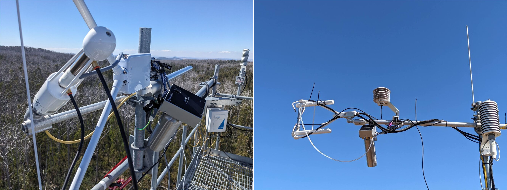

# Sensor calibration

Of major EC-related instruments

## Anemometer

Usually no DIY calibration possible. Can check the zero by covering the anemometer (plastic bag or similar) in a wind-still room. Regular cleaning required! The wicks can disintegrate and can sometimes block the signal pathway of the ultrasonic signal.

## IRGA

General: - Use calibration gas mix resembling natural air, ie including 21% O2 to avoid band-broadening in the IRGA. Just the target CO2 concenration in pure N2 is not sufficient.

-   **ICOS protocol**: From @sabbatini_icos_2017 : ICOS require an IRGA to be calibrated twice per year, four times per year if the instrument is new. It is preferred to calibrate the IRGA in the field to minimise downtime. Otherwise, a replacement IRGA must be installed to avoid gaps in the data while the actual IRGA is away for calibration. The zero of H2O and CO2 signals must be checked regularly between the calibrations. The recommended frequency is every two months. In the field, the sensor is not cleaned initially before checking the zero. Thresholds of zero "drifts shall be based on CO2 concentration because more stable (drifts \>30 μmol mol-1 CO2 are considered significant). As an indication, also H2O drifts \> 1.5 mmol mol-1 are considered significant." Factory calibrations of the IRGA is required every second year! Allowing up to 30 μmol mol-1 CO2 drift seems quite generous.

-   **World Meteorological Organistation guidelines**\
    See their strict guide on the Observations of CO2, CH4 and N2O at Global Atmosphere Watch Stations regarding calibration: @world_meteorological_organization_wmo_measurement_2025

-   any Irga calibration papers?

Sources of calibration gases:

-   [ClearGas](https://cleargas.au/) CLeargas manufacture a variety of calibration gases. They provide the gas in convenient, small sizes which makes travel to a fieldsite easy when on-location calibration is required for remote tower sites. However, by default, the *accuracy of the calibration gas is 2%*, ie not good enough for precise measurements. \* other Australian sources \* overseas resources (NOAA)?

To calibrate the H2O signal, a dewpoint generator is required. E.g. Licor [Li-610 Portable dewpoint generator](https://www.licor.com/products/gas-analysis/LI-610).

### Licor 7500xxx

-   requires Li7500-specific shroud
-   chemicals get changed before each calibration. It takes 24 hours to flush the system once the chemicals are changed. Only then the actual calibration can take place.

### Campbell Scientific Irgason

-   requires Irgason-specific shroud
-   Chemicals need changing every two years or when drift occurs. Similar to the Licor IRGAs, the system needs to be flushed with the new chemicals for 24 hours before the calibration can happen.

### Checking CO2 and H2O zero in the field

Campbell Scientific provide a handheld tool (*"Zero Air Generator"*) that allows to check the zeros of H2O and CO2 in the field. The tools uses scrubber chemicals to produce "zero" air, ie air without CO2 or H2O. It has a built-in, battery powered pump that circulates the "zero" air through the calibration shroud that is installed in the optical path of the open-path irga (either Licor 7500xx or Campbell Scientific Irgason). A tube connects the "out" port of the Zero Air Generator with the shroud. Air is circulated through the shroud using the battery-powered pump of the device.\
To check/set the zero, the temperature sensor of the shroud is connected to the control unit of the IRGA to estimate the dew point. The irga must be turned off before connecting / disconnecting the temperature sensor. The instrument-specific software by the manufacturer (*ECmon* or *Licor75xx*) is used to check and potentially set the zero once the system is flushed with "zero" air, and the values are stable (allow 10 min to 30 min). See their instruction manuals for details. The Zero Air generator looks similar to the scrub bottle that is part of Campbell Scientific AP200 profile system. But: the Zero Air Generator has a built-in pump, while the AP200 scrub bottle relies on air flow of the profile system!

-   [Campbell Scientific Zero Air generator](https://www.campbellsci.com.au/31022)

-   This allows a relatively fast, hassle free check of the zero that can be done on location on the tower. A laptop with the instrument control software and USB cable (default USB A to B in case of a Campbell Scientific Irgason, or the instrument-specific USB-cable in the case of a Licor7500a/RS) or serial cable with specific board adapter in case of Licor 7500 are required.

    

## Campbell Scientific logger calibration?

-   every few years at manufacturer - who does actually do that? What's the logger drift?