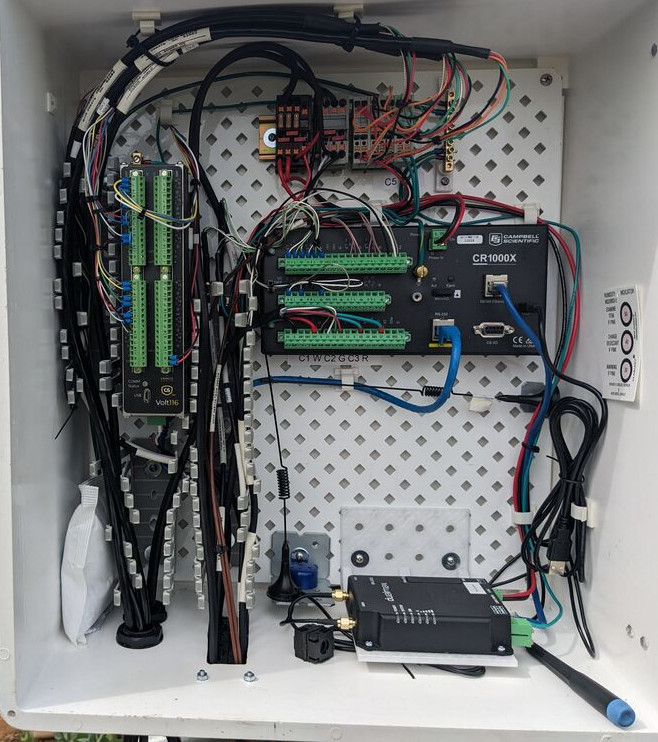
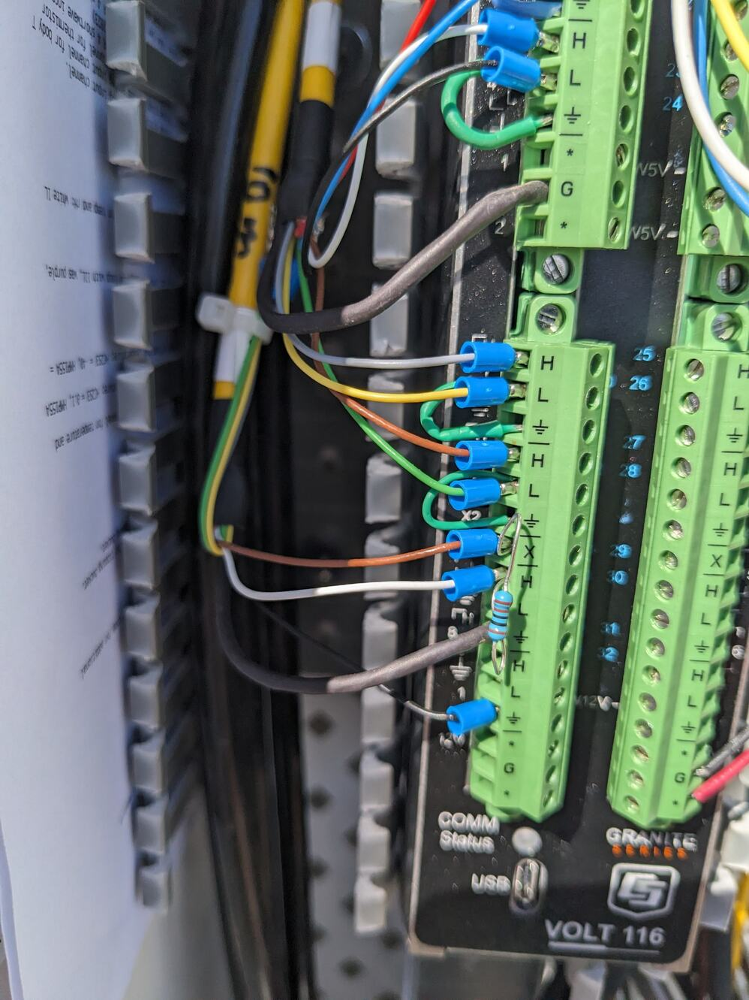

# Sensors and wiring

This guide applies to tower using the OzFlux standard programs (available from [OzFlux logger code Github repository](https://github.com/OzFlux/logger_code), Ian McHugh).

## Wiring information

This wiring guide is for an all-in one flux tower system. This system consists of one logger with extension module handling all sensors at once, wired up in a single enclosure. Examples of towers using this wiring scheme and standard program are: Boolcoomatta, the three Dookie towers. Even if logger, extension module and soil system are separate from each other, the basic wiring still applies to some extent.

{fig-alt="All-in-one EC system with soil sensors, modem, logger, Volt116 module, fuse panel, SDI-12 hub, modem."}

Hardware used:

-   Campbell Scientific CR1000x(e) data logger

-   Campbell Scientific Volt116 extension module

-   Campbell Scientific Irgason

-   Kipp & Zonen CNR4 four-component radiometer

-   Vaisala HMP155 temperature and humidity sensor

-   Apogee PAR sensor

-   Hukseflux FG01 soil heat flux (two at Dookie towers, four for Boolcoomatta tower)

-   Campbell Scientific TCAV averaging soil temperature probe (two for Dookie towers, four for Boolcoomatta)

-   Campbell Scientific CS650 soil mositure probe (four for Dookie towers, and Boolcoomatta tower)

-   Campbell Scientific SoilVUE10 soil profile probe (Boolcoomatta only)

While Campbell Scientific Easyflux uses are different logger software, their detailed manufacturer sensor and wiring information is a great read, even though the wiring is slightly different: [EasyFlux](https://www.campbellsci.com.au/easyflux-dl) and [specifically EasyFlux manual](https://s.campbellsci.com/documents/au/manuals/easyflux-dl-cr6op.pdf).

### User constants

Some parts of the standard program must be modified to unique settings for each tower.

Data logger constants:

`Const STATION_NAME = "Dookie2_EC" Const PAKBUS_ADDR = 1`

`'Server information for data upload`

`Const Server = "server.address.au"`

`Const User = "username" Const Pass = ""`

VOLT116 user constants

`Const CDMVOLT116_1_SN = 1234 ' CDM-VOLT116 serial number ser no 7008 in Dookie1`

`Const CDMVOLT116_1_ADDR = 1 ' CDM-VOLT116 CPI address (default is 1)`

`Const CDMVOLT116_1_DESC = "Mux_Tower" ' CDM-VOLT116 descriptor (name for instrument, even in case there is only one Volt116)`

### Irgason (Campbell Scientific) / 7500RS Irga (Licor) + CSat3b (Campbell Scientific)

The integrated irga and 3D anemometer (Irgason) and separate instruments Licor 7500RS irga plus 3D anemometer Cambell Scientific are wired in a similar way. All instruments communicate via the SDM bus when using the OzFlux standard program. The SDM cables for the two separate iga/anemometer get combined in a SDM hub, and only one cable connects both to the data logger. See section on SDM hub for details when using separate IRGA and CSat.

Wiring and constants.

`Const EC100_SDM_ADDR = 1 'Unique SDM address for EC100.`

`Const CO2_SIG_STRGTH_THRESHOLD = 0.7 'Remove gas analyzer CO2 data when CO2 signal strength is less than sig_str_CO2.`

`Const H2O_SIG_STRGTH_THRESHOLD = 0.7 'Remove gas analyzer H2O data when H2O signal strength is less than sig_str_H2O.`

| Logger port | Function      | Wire colour |
|-------------|---------------|-------------|
| C1          | SDM data      | green       |
| C2          | SDM data      | white       |
| C3          | SDM enable    | brown       |
| G           | SDM reference | black       |
| g           | SDM shield    | clear       |
| 12V         | Power         | red         |
| G           | Ground        | black       |
| G           | Powers shield | clear       |

### Soil heat flux

The unique calibration coefficients must be entered for each sensor. Calibration coefficients are printed on the cable and anre also available on the calibration sheet provided by the manufacturer.

`Const SHF_ANALOG_INPUT = 1 'Unique differential analog input channel.`

`Const NMBR_SHF = 2 'Unique number of HFP01 to measure.`

`Const SHF_FIELDS = "Fg_01,Fg_02" 'Field names, ie names in the data table`

`Const SHF_CAL_1 = 61.12 'Unique coefficient for HFP #1 (1000/sensitivity). Example for HFP01 #23316 61.12 uF/V`

`Const SHF_CAL_2 = 60.38 'Unique coefficient for HFP #2 (1000/sensitivity). HFP01 #23317`

`Data SHF_CAL_1 ' must be present for each unique heat flux sensor`

`Data SHF_CAL_2 ' must be present for each unique heat flux sensor`

| Logger port | Function               | Wire colour |
|-------------|------------------------|-------------|
| 1H          | HFP01 signal           | white       |
| 1L          | HFP01 signal reference | green       |
| gnd         | HFP01 shield           | clear       |
| 2H          | HFP02 signal           | white       |
| 2L          | HFP02 signal reference | green       |
| gnd         | HFP02 shield           | clear       |

If more than two soil heat flux plates are used, expand the program user constants and wiring accordingly.

### PAR sensor

Apogee CS310 PAR sensor program constants and wiring:

`Const PAR_ANALOG_INPUT = 9 ' specify unique SE analog input channel for the PAR sensor`

`Const PAR_MULT = 100 ' Multiplier provided by manufacturer and/or printed on cable, default is 100.0`

| Logger port | Function          | Wire colour |
|-------------|-------------------|-------------|
| 5H          | PAR signal        | white       |
| gnd         | PAR signal ground | black       |
| gnd         | PAR shield        | clear       |

TO ADD:

Licor PAR sensor and multiplier configuration and wiring

### Averging soil temperature thermocouple (TCAV)

`Const TSOIL_ANALOG_INPUT = 3 'Unique differential analog input channel.` `Const NMBR_TSOIL = 2 'Unique number of TCAV to measure.`

TCAV #1

| Logger port | Function                      | Wire colour |
|-------------|-------------------------------|-------------|
| 3H          | Temperature signal TCAV #1    | purple      |
| 3L          | Temperature reference TCAV #1 | red         |
| gnd         | Shield                        | clear       |

TCAV #2

| Logger port | Function                      | Wire colour |
|-------------|-------------------------------|-------------|
| 4H          | Temperature signal TCAV #2    | purple      |
| 4L          | Temperature reference TCAV #2 | red         |
| gnd         | Shield                        | clear       |

### Soil moisture user constants / wiring (CR1000X)

`Const CS65X_1_SDI12_PORT = C5 'Unique control port.`

`Const CS65X_2_SDI12_PORT = C7 'Unique control port.`

`Const NMBR_CS65X = 4 'Unique number of CS65X to measure.`

If there are more than two CS650 soil moisture sensors (or, in general, multiple SDI-12 sensor of the same type), it is best to not wire the sensors directly to the logger panel. Instead, build a terminal block which combines multiple data, power, ground lines, etc together (see section on [SDI-12 sensors](./SDI12sensors.html) and terminal blocks). Then run a single cable to the corresponding port on the logger.

Be careful with control ports, though: To combine multiple sensor control wires into one SDI-12 terminal, the sensors must be programmed to have a unique SDI-12 address ID! In the example below, two sensors with SDI-12 ID #0 and SDI-12 ID #1 are connected to control port C5, another set of sensors with SDI-12 ID #0 and SDI-12 ID #1 are wired to control port C7! [The SDI-12 ID of a CS650 sensor can be changed](./SDI12sensors.html). Either via the CS650 mode in `Loggernet Devconfig`, or via a terminal command through a datalogger (see [SDI-12 sensors](./SDI12sensors.html)). While changing SDI-12 IDs, only one sensor can be connected to a control port. SDI-12 sensors can be connected to any control (C) port with an odd number.

| Logger port | Function                           | Wire colour |
|-------------|------------------------------------|-------------|
| C5          | SDI-12 data #1 (Address = 0 and 1) | green       |
| C7          | SDI-12 data #2 (Address = 0 and 1) | green       |
| gnd         | RS-232 #1                          | orange      |
| gnd         | RS-232 #1                          | orange      |
| 12V         | SDI-12 power +12V #1               | red         |
| 12V         | SDI-12 power +12V #2               | red         |
| G           | SDI-12 data/power reference #1     | black       |
| G           | SDI-12 data/power reference #2     | black       |
| gnd         | Shield #1                          | clear       |
| gnd         | Shield #2                          | clear       |

### Rain gauge CS701 user constants / wiring (CR1000X)

Many rangauges use similar wiring. Check the manual if your specific models followes the wiring scheme of the Campbell Scientific CS701 rain gauge.

`Const RAIN_PULSE_INPUT = P1 'Unique pulse input channel for tipping bucket.`

`Const RAIN_CAL = 0.2 'Unique multiplier for tipping bucket.`

| Logger port | Function         | Wire colour |
|-------------|------------------|-------------|
| P1          | Signal           | black       |
| G           | Signal reference | white       |
| gnd         | Shield           | clear       |

### Air temperature and humidity (Vailsala HMP155 wired to Volt116)

`Const T_RH_ANALOG_INPUT = 1 'Unique differential input channel for temperature and humidity probe.`

`Const T_RH_T_MULT = 0.14 'Unique multiplier for temperature; HC2S3 = 0.1, HMP155A = 0.14, or HMP45C = 0.1.`

`Const T_RH_`

`T_OFFSET = -80 'Unique offset for temperature; HC2S3 = -40, HMP155A = -80, or HMP45C = -40.`

**Depending on the cable length, the Vaisala HMP155 is wired either in singled ended mode or in differential mode!**

#### HMP155 Single ended mode, for short cable, less than 6.1 m long:

| Logger port | Function                            | Wire colour |
|-------------|-------------------------------------|-------------|
| 1H          | Temperature signal                  | yellow      |
| 1L          | RH signal                           | blue        |
| Gnd         | Temperature and RH signal reference | white       |
| Power Gnd   | Power ground                        | black       |
| 12V         | 12V power                           | red         |
| Gnd         | Shield                              | clear       |

#### HMP155 Differential mode for long cables over 6.1 m long

| Logger port | Function | Wire colour |
|------------------------|------------------------|------------------------|
| 1H | Temperature signal | yellow |
| 1L | Temperature signal reference | NA (connect 1L and 2L with jumper) |
| 2H | Rh signal | blue |
| 2L | Temperature and RH signal reference | white (and connect 1L and 2L with jumper) |
| Power Gnd | Power ground | black |
| 12V | 12V power | red |
| Gnd | Shield | clear |

### 4-component radiation user constants / wiring (Kipp & Zonen CNR4 wired to VOLT116)

CNR4 program and calibration constants with examples

`Const NR_ANALOG_INPUT = 3 'Unique differential analog input channel.`

`Const NR_TsENS_ANALOG_INPUT = 13 'Unique single-ended analog input channel for body T`

`Const NR_TsENS_VX = X2 'Unique voltage excitation channel for thermistor`

`Const NR_SW_INCOMING_CAL = 1000/12.82 'Unique multiplier for CNR 4 shortwave incoming radiation (1000/sensitivity). Kipp+Zonen CNR4 Ser No 234203 (Dec 2023)`

`Const NR_SW_OUTGOING_CAL = 1000/12.63 'Unique multiplier for CNR 4 shortwave outgoing radiation (1000/sensitivity). Kipp+Zonen CNR4 Ser No 234203 (Dec 2023)`

`Const NR_LW_INCOMING_CAL = 1000/9.09 'Unique multiplier for CNR 4 longwave incoming radiation (1000/sensitivity). Kipp+Zonen CNR4 Ser No 2234203 (Dec 2023)`

`Const NR_LW_OUTGOING_CAL = 1000/9.41 'Unique multiplier for CNR 4 longwave outgoing radiation (1000/sensitivity). Kipp+Zonen CNR4 Ser No 234203 (Dec 2023)`

| Logger port | Function | Wire colour |
|------------------------|------------------------|------------------------|
| ***First cable ("S" port on sensor)*** |  |  |
| 3H | Incoming shortwave radiation signal | red |
| 3L | Incoming shortwave radiation reference | blue |
| 3L to gnd | Jumper | NA (connect 3L and gnd with jumper cable) |
| 4H | Outgoing shortwave radiation signal | white |
| 4L | outgoing shortwave radiation reference | black |
| 4L to gnd | Jumper | NA (connect 4L and gnd with jumper cable) |
| 5H | Incoming longwave radiation signal | grey |
| 5L | Incoming longwave radiation reference | yellow |
| 5L to gnd | Jumper | NA (connect 5L and gnd with jumper cable) |
| 6H | Outgoing longwave radiation signal | brown |
| 6L | Outgoing longwave radiation reference | green |
| 6L to gnd |  | (NA) connect 5L and gnd with jumper cable |
| Gnd | Shield | clear |
| ***Second cable ("T" port on sensor)*** |  |  |
| 7H | Thermistor signal | white |
| gnd | Thermistor reference | black |
| X2 | Thermistor excitation | red |
| Gnd | Ground | Thick black cable |
| gnd | Shield | clear |
|  | unused wires | various |
|  |  |  |
| ***When using a "T"cable from Kipp & Zonen*** | The "T" cable does not have a pre-soldered resistor at the "T" cable end and has different wire colours! | Typically yellow CNR4 cables are from Kipp+Zonen, black CNR4 cables are from Campbell Scientific |
| 7H | Thermistor excitation | white |
| Gnd | Thermistor signal reference | black (thin black wire) |
| X2 | Thermistor excitation | brown |
| X2 to H | connect with **resistor 1 KΩ** | (NA) resistor between X (brown) and H (white) with 1KΩ |
| Gnd | Shield | black (thick black wire) |
|  | unused wires | various |

-   The Kipp and Zonen CNR sensor provided cables are different than the cable provided by Campbell Scientific! Campbell Scientfic adds a resistor to the cable!

Kipp and Zonen yellow Thermistor yellow cable has different colours and requires to add an additional resistor to the wiring panel as follows:

# Cable faults
In case of cable faults:
To check check the integrity of copper cables: [Cable tester / verifier](https://www.trend-networks.com/au/product/vdv-ii-series/)

# Cable repair
*  various no-solder splices

[Home](./Home.html)