# Tower types

## Single pole towers

Very small footprint, but need a foundation for the pole and potentially guy wires to avoid movement. Cheap, easy to install without disturbing the environment. Access to the sensors is via portable ladder.

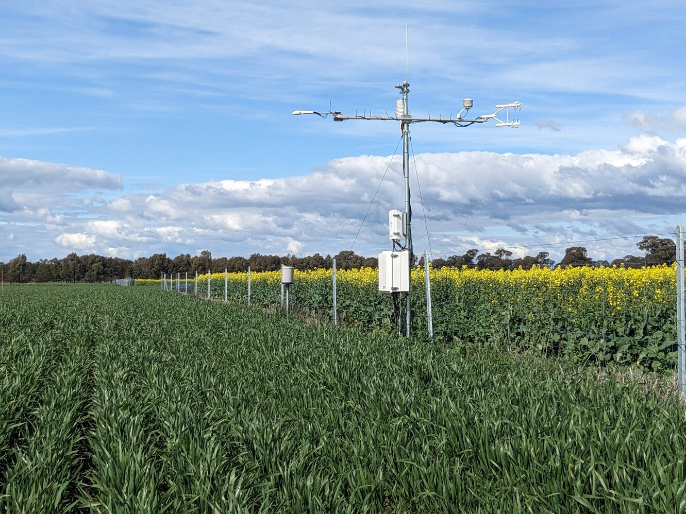

## Tripod towers

Maximum height up to \< 4 m. Tripod base has quite a large footprint. Easy to set up, allows to take the tower into the ecosystem with little disturbance and can be removed without leaving much of a trace. Legs can be adjusted to allow for uneven ground.

E.g. Campbell Scientific: [CM106B-CSA](https://www.campbellsci.com.au/cm106b-csa)

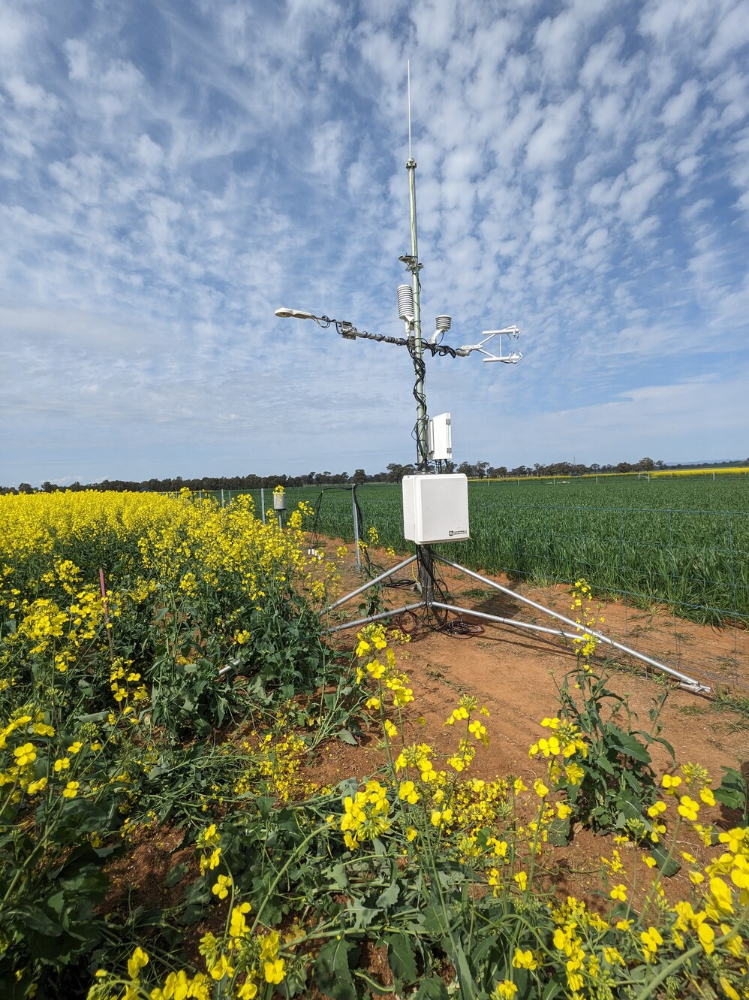

## Hinged towers

Various heights up to 14 m. These towers can be climbed (working at heights certificate required). But the hinged construction allows to lower the tower down for instrument installation and maintenance to avoid climbing.

Available from: [APAC Portable Hinged Tripod Lattice Tower, AL340 Series](https://apacinfrastructure.com.au/al340-portable-tripod-lattice-tower-8-metre)

APAC Infrastructure Pty Ltd, Unit 6/33-47 Fred Chaplin Circuit, Caloundra, Sunshine Coast, QLD, 4551

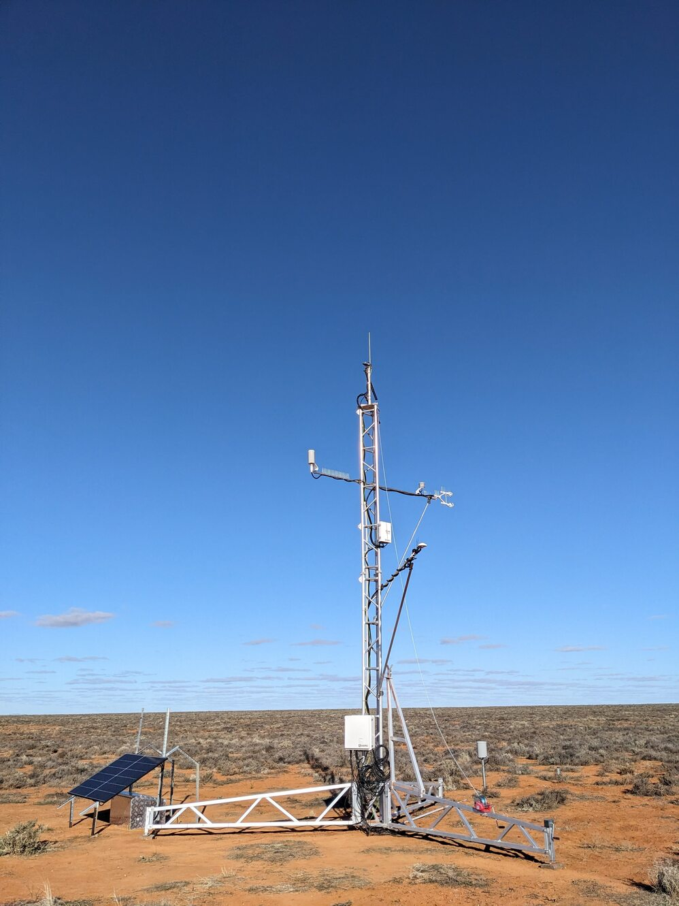

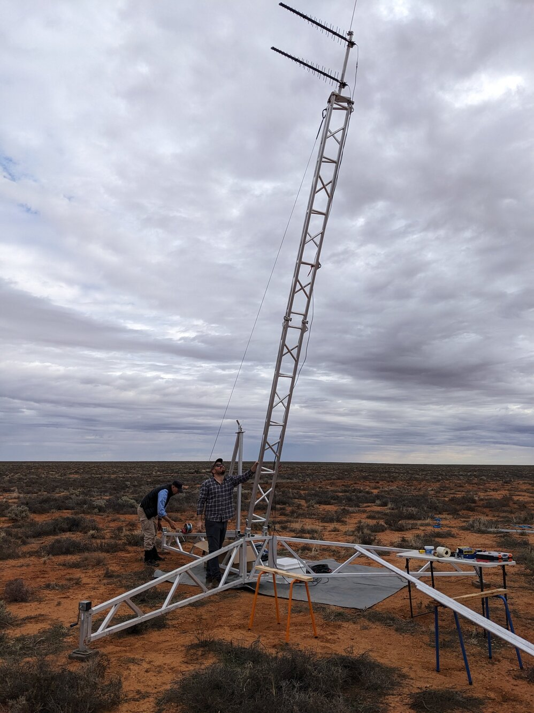

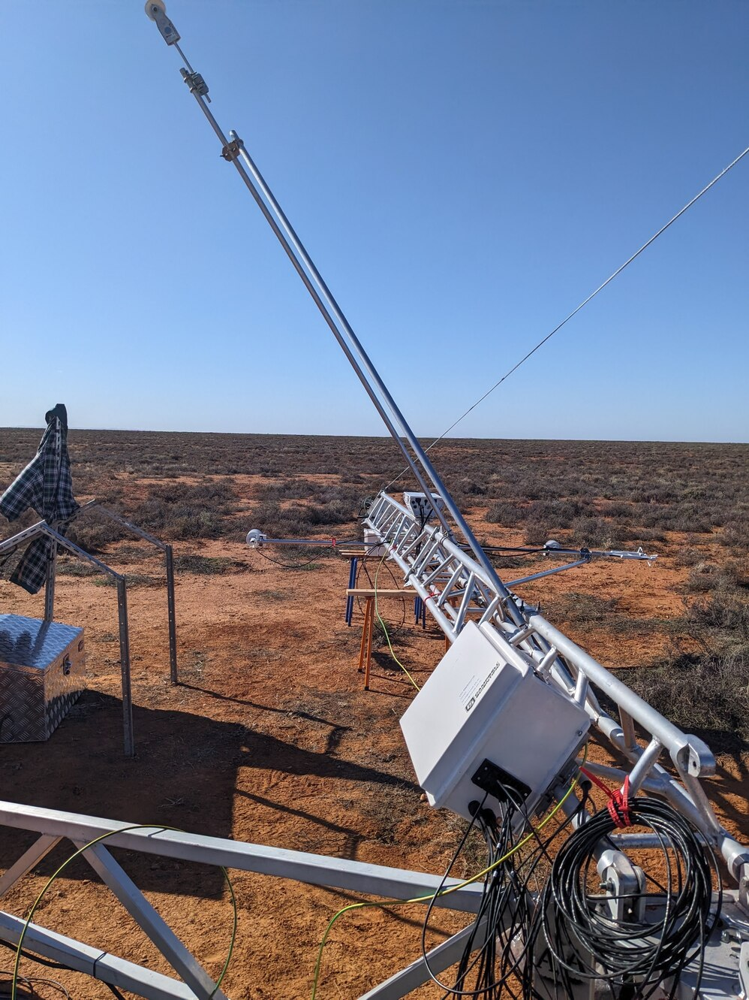

## Telescopic towers

E.g pneumatic: [Light telescopic towers](https://evtagroup.com.au/2-uncategorised/117-telescopic-light-tower)

EVTA Group, Gisborne, 12 Meek Street, New Gisborne, Victoria, 3438

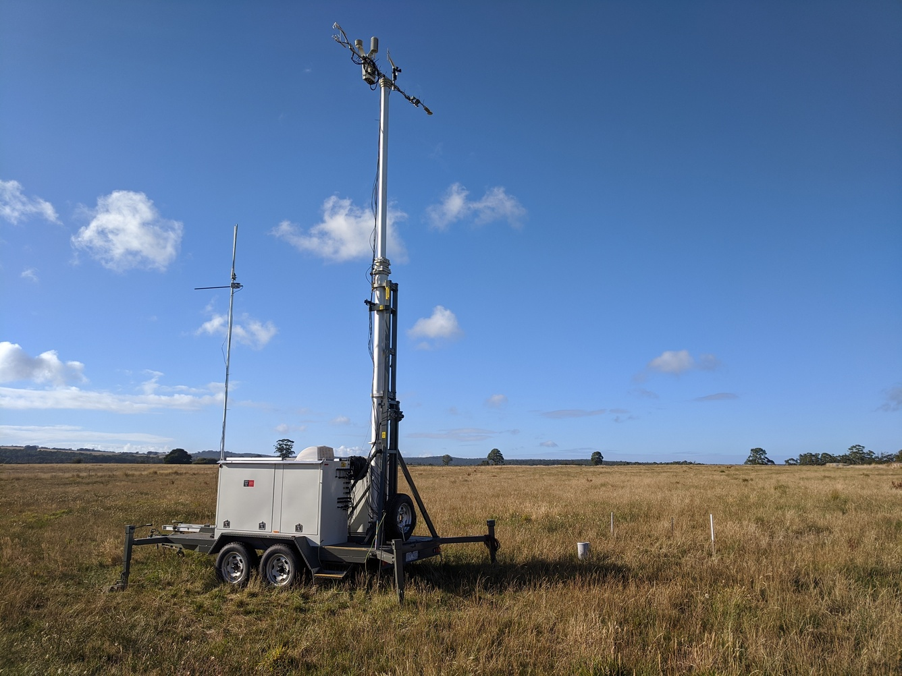

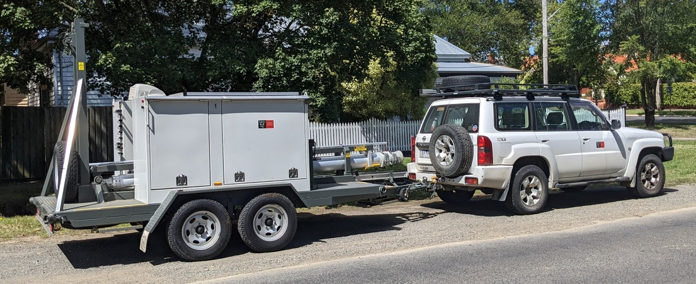

## Scaffolding towers

No recommended in Australia!

OHS regulations require tower safety inspection every 30 days! But scaffolding towers are commonly used in Europe (Americas?) with and without guy wires up to 50+ m. Benefit: scaffolding towers are cheap to build, and can be built on location without bringing in large cranes. This allows to minimise disturbance of the ecosystem during the build phase. The scaffolding can be buit in close vicinity of trees / branches which potentially allows to undertake leaf-level measurements and sampling in the canopy. The small size and lack of disturbance minimises the updraft, "chimney" effect that surround tall towers.

## Guyed towers

Small footprint, but usually require crane to install, hence more initial disturbance to the environment. Guywires allow for slim and tall tower structures. However, the guy wires can bring the tower down when a tree falls on them (see Warra and Wombat Forest.

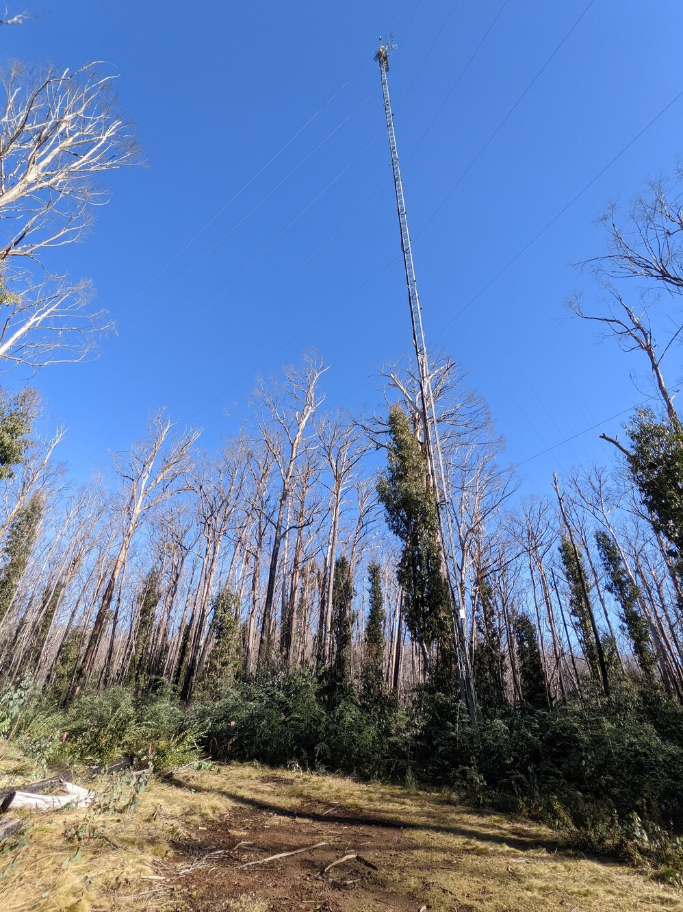

## Stand-alone towers

Stand-alone towers require large foundations, but provide a safe and stable tower without the danger of trees falling on a guy wire. Frequently, large excavation for the foundation are required, causing disturbance in the vicinity. Cranes are needed to install the tower, that bring soil compaction. Tall stand-alone towers can be big enough for a stair case. That allows easy access to the instrumentation on top. With regulation staircase on the tower, climbing certificates might not be required (check your local laws and regulations.

The large footprint of stand-alone towers allows generous platforms on top. However, in some cases, it can be difficult to install instrumentation on the edge of the tower where there is no platform and if the location is far away from the stair case. Large. tall towers like e.g. Tumbarumba, have a wide lattice construction, limiting options for accessing some locations without extensive climbing.

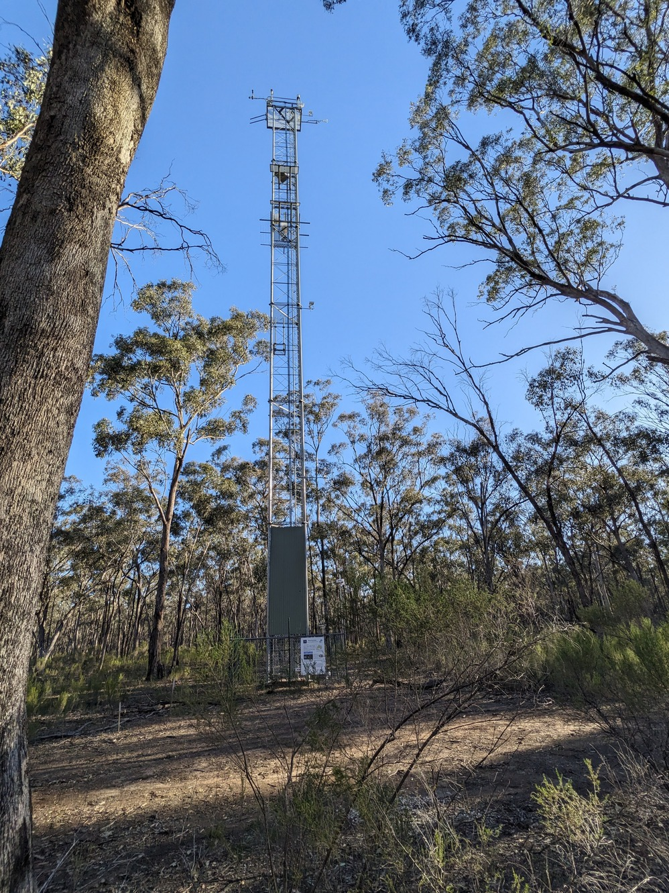

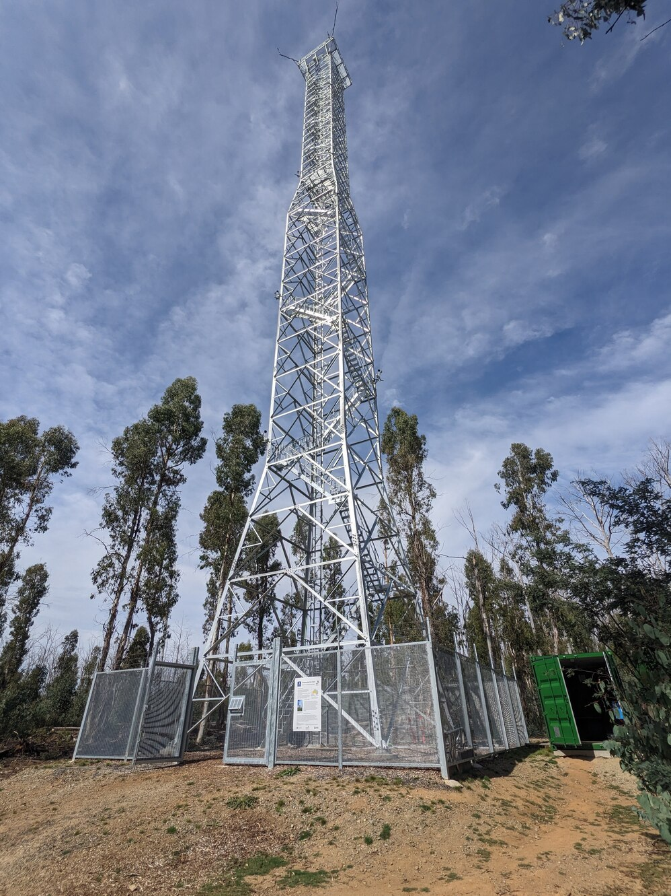

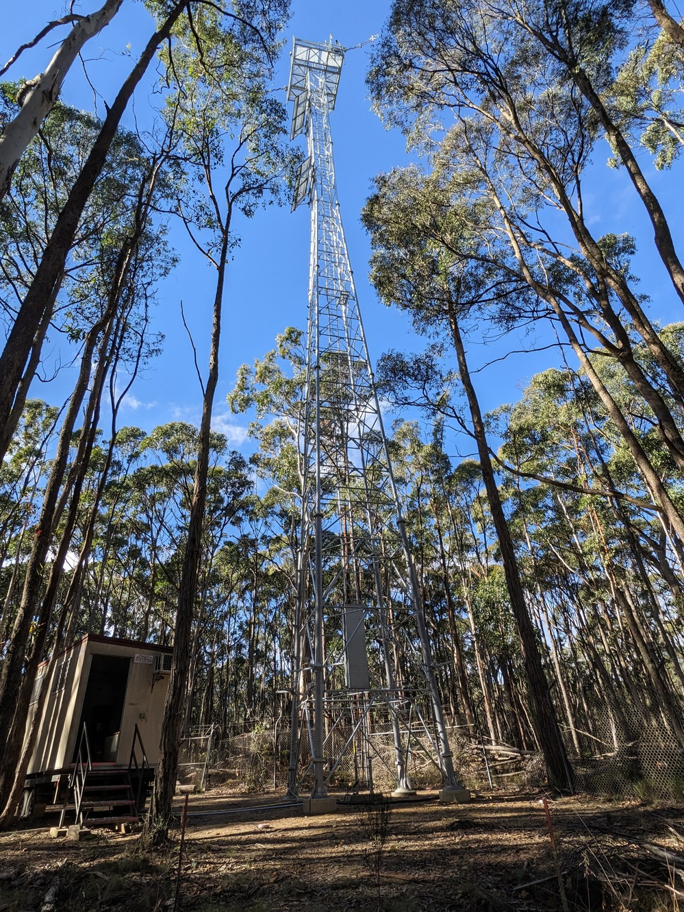