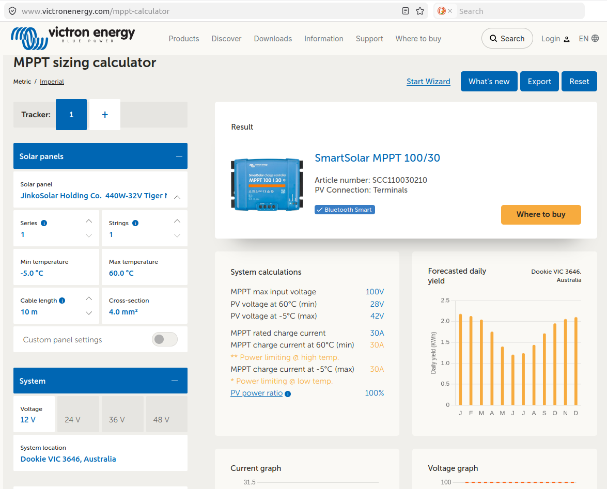

# Power

## Powering the flux tower

### Power demand

-   [Campbell Scientific power budget spreadsheet](https://www.campbellsci.com.au/downloads/power-budget-spreadsheet) and tutorial. This spreadsheet provides power consumption data for Campbell Scientific devices and allows to calculate an overall power budget.

-   [Victron MPPT calculator](https://www.victronenergy.com/mppt-calculator): Suggests charge controller model, calculates daily yield from solar panel size and configuration, voltage, and location. This calculator includes an allowance for oversizing solar panels on a charge controller.

![Victron MPPT calculator result for the Whroo flux tower Au-Whr. The tower is equipped with an EC logger system for flux and micrometeorology sensors, a separate logger system for soil-related sensors, a Heitronics surface temperature system, and a six-level storage profile system. The tower is powered by two 445 W solar panels in series feeding two LifePo4 200 Ah batteries via a MPPT100/50 charge controller. \
The charge controller is just within the allowed threshold of 130% oversized solar panels. \
The selected charge controller delivers only 50% (0.5C) of the possible charge current of the batteries! This low charge current is however high enough because high current, fast charging at 100A is not required at this location and fast charging would degrade the batteries faster in the long run. As the system is operated at up to 48°C air temperature, the heat-dissipation of charging at 100A would introduce unnecessary additional thermal issues too (Markus Loew).](images/power/Whroo_Victron_MPPT_calculator.png){alt="Victron MPPT calculator result for a the Whroo tower. Tower is equipped with EC logger system for flux and micrometeorology sensors, separate logger for soil-related sensors, Heitronics suface temperature system, six-level profile system. The tower is powered by two 445 W solar panels in series (Markus Loew)."}

For comparison: Flux-towers in the ICOS network (Class 1, 2) are required to have at least 2.5-3 kW of continuous(!) power available year-round @rebmann_icos_2018 .

### Power sources

#### Mains power

If an electrical power grid is available nearby to tap into, mains power is a convenient power source.\
E.g. the *Ecosense Forest* in Germany with flux tower many research systems is powered from the nearest electrical interchange 700 m away (@tesch_ecosense_2025).\
The *Kranzberger Forst* research site with scaffolding towers and canopy crane site is connected to continuous municipal electrical power @haberle_kroco_2003 from the nearby township.

The install of a 240V electrical system at a tower location requires a certified electrician. Any 240V power connection beyond plugging an instrument into a e.g. solar-powered inverter powerboard requires electrical inspection and approval!

#### Generator

A generator is a powerful source of energy. I requires regular maintenance (e.g. every 100 hours of runtime) and re-fueling, though. Daily running costs are relatively high compared to solar power. Operational costs of the generator powering the Tumbarumba tower is about \$9 per day (fuel - pre-2026 price - and regular maintenance included). That generator requires maintenance four times a year and re-fueling twice per year. It runs for about six to eight hours every 8 days to charge the batteries that power the research site. A local car mechanic services the generator when the maintenance interval is up. The run-time of the generator is monitored online to advice the mechanic.\
If a generator is used, "the effect of its exhaust gases on the trace gas measurements must be minimised" and wind-direction-based screening might be required to avoid generator exhaust gases in the footprint (@aubinet_eddy_2012). The generator should be deployed away from the flux instruments to avoid bias @moore_beginners_2024 , @rebmann_icos_2018 .

#### Solar

Solar panels on tower can affect the wind flow and radiation patterns. Consider wind loading on tower!

-   DIY battery system / professionally installed power system

### Solar power systems

-   Battery box
-   Solar panel size
-   Solar panel mount
-   Charge controller
-   Battery type, recommendations
-   Earth rod
-   Fuses, switches

### Charge controllers

-   [Morningstar ProStar MPPT solar charge controller](https://www.morningstarcorp.com/products/prostar-mppt/). The maximum solar panel size: 300W@12V.
-   [Victron SmartSolar Charge controllers](https://www.victronenergy.com/solar-charge-controllers) Usually, for a 400 W panel, use the 100/30A or 100/50A charge controller. Check the Victron MPPT sizing calculator to determine the [charge controller size](https://www.victronenergy.com/mppt-calculator), see below:

### Power to the instruments, electrical wiring

-   Victron wiring guidebook for solar power battery systems: "Wiring unlimited" [Victron Energy Wiring unlimited (pdf)](https://www.victronenergy.com/upload/documents/Wiring-Unlimited-EN.pdf), @leeftink_wiring_2019
-   For general wiring and soldering practices, refer to [NASA Workmanship standard for crimping, interconnecting cables, harnesses and wiring](https://standards.nasa.gov/standard/NASA/NASA-STD-87394), @nasa_workmanship_2015
-   12V, 24V, split systems
-   cable connections (crimps, soldering, on-location options)
-   earth bars (e.g. Jaycar copper bar with 3d printed feet)
-   sensor hubs
-   glue-on cable routing

[Home](./Home.html)